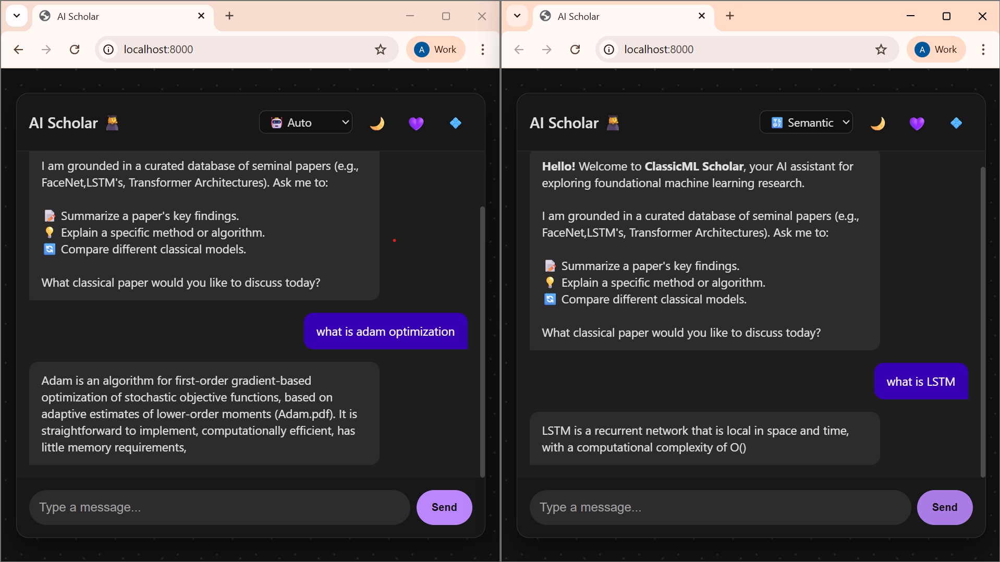
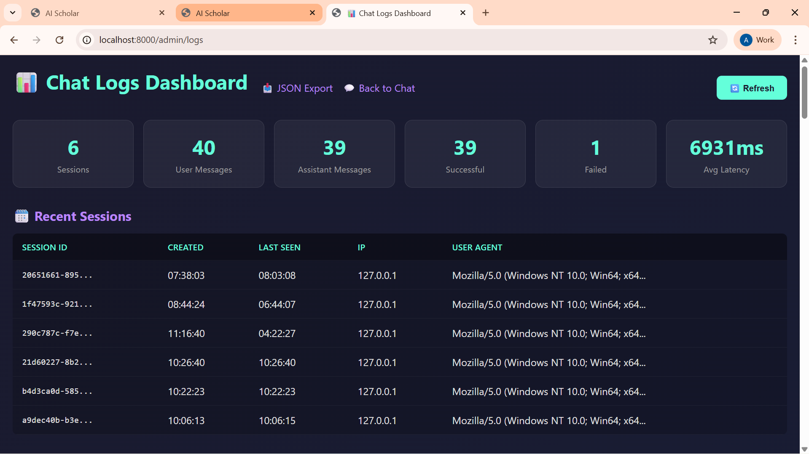

# AI Scholar — Hybrid RAG Chatbot

A Retrieval-Augmented Generation (RAG) system that combines **semantic and lexical search** over research papers using FastAPI, SQLite, and Google's Gemma LLM.




## Overview

**AI Scholar** enables users to query a curated corpus of machine learning research papers through an interactive web interface. The system uses:

- **Hybrid retrieval**: BM25 (sparse) + FAISS HNSW (dense vector search) with Reciprocal Rank Fusion
- **Dual chunking strategies**: Fixed-size and semantic splitting for flexible retrieval
- **Real-time SSE streaming**: Word-by-word response streaming
- **Session persistence**: SQLite logging with chat history and analytics dashboard
- **Rate limiting**: Per-session and per-IP sliding-window enforcement
- **Async I/O**: Non-blocking logging queue and thread-pooled RAG inference

## Table of Contents

- [Overview](#-overview)
- [Quick Start](#-quick-start)
- [Architecture](#%EF%B8%8F-architecture)
- [Installation](#-installation)
- [Configuration](#%EF%B8%8F-configuration)
- [Usage](#-usage)
  - [Building Indexes](#building-indexes)
  - [Running the Web Service](#running-the-web-service)
  - [CLI Mode](#cli-mode)
  - [Admin Dashboard](#admin-dashboard)
- [Project Structure](#-project-structure)
- [API Reference](#-api-reference)
- [Performance](#-performance)
- [Troubleshooting](#-troubleshooting)
- [Contributing](#-contributing)
- [License](#-license)
- [Support](#-support)

---

## Quick Start

### Prerequisites

- Python 3.12+
- `pip` or `uv`
- Google Gemini API key (free tier available)

### 1. Clone & Setup

```bash
git clone <repo-url>
cd innovate/rag
python -m venv .venv
source .venv/bin/activate  # On Windows: .venv\Scripts\activate
pip install -e .
```

### 2. Configure Environment

```bash
cp .env.example .env
# Edit .env and add your Gemini API key
echo "GEMINI_API_KEY=your_key_here" >> .env
```

### 3. Add Research Papers

```bash
mkdir -p data/raw_pdfs
# Copy PDFs to data/raw_pdfs/
```

### 4. Build Indexes

```bash
python scripts/build_index.py
# Generates: artifacts/{fixed,semantic}/chunks.jsonl, faiss_hnsw.index, etc.
```

### 5. Launch Web Service

```bash
uvicorn webapp.app.main:app --reload --host 0.0.0.0 --port 8000
```

Visit **http://localhost:8000** in your browser.

---

## Architecture

### System Flow

```
User Query (Browser)
    ↓
POST /api/message (rate limit check, log session)
    ↓
Returns { session_id, request_id }
    ↓
GET /api/stream (SSE)
    ├─ Retrieve: BM25 + FAISS HNSW → RRF fusion
    ├─ Augment: Build prompt with context
    ├─ Generate: Call Gemma via Gemini API
    ├─ Stream: Emit word-by-word SSE events
    └─ Log: Async queue → SQLite
    ↓
Response streamed to browser
```

### Component Stack

| Layer | Technology | Purpose |
|-------|-----------|---------|
| **Frontend** | HTML/CSS/JS | Real-time chat UI, theme switcher |
| **API Server** | FastAPI + Uvicorn | Async HTTP + SSE streaming |
| **Retrieval** | FAISS (HNSW), BM25 | Hybrid semantic + lexical search |
| **LLM** | Gemma 27B (via Gemini API) | Text generation |
| **Logging** | SQLite + WAL mode | Chat history, analytics |
| **Scheduling** | asyncio queue | Non-blocking log writes |
| **Rate Limiting** | In-memory deques | Per-session / per-IP sliding windows |

---

## Installation

### Option A: Development Install

```bash
pip install -e ".[dev]"
```

### Option B: Production Install

```bash
pip install -r requirements.txt
```

### Key Dependencies

```toml
fastapi>=0.128.2
uvicorn[standard]>=0.40.0
google-genai>=1.61.0
sentence-transformers>=5.2.2
faiss-cpu>=1.13.2
rank-bm25>=0.2.2
aiosqlite>=0.22.1
pymupdf>=1.26.7
pydantic>=2.12.5
```

---

## Configuration

### `configs/default.yaml`

```yaml
paths:
  pdf_dir: "data/raw_pdfs"
  artifacts_dir: "artifacts"
  prompts_dir: "configs/prompts"

chunking:
  chunk_size: 1200        # Characters per chunk
  overlap: 200            # Overlap between chunks
  fixed_enabled: true     # Enable fixed-size chunking
  semantic_enabled: true  # Enable semantic chunking

embedding:
  model_name: "sentence-transformers/all-MiniLM-L6-v2"
  normalize: true         # Unit-norm vectors for cosine similarity

faiss:
  M: 32                   # HNSW max connections
  ef_construction: 200    # HNSW construction parameter
  ef_search: 128          # HNSW search parameter

retrieval:
  bm25_k: 200             # Top-k BM25 results
  dense_k: 50             # Top-k FAISS results
  final_k: 8              # Final merged results
  rrf_k: 60               # RRF fusion parameter
  max_per_doc: 2          # Max chunks per PDF in final results
  chunking_mode_default: "semantic"

llm:
  model: "gemma-3-27b-it"
  temperature: 0.2        # Lower = more deterministic
  max_output_tokens: 800
```

### Environment Variables

```bash
GEMINI_API_KEY=your_api_key_here
# Optional:
LOG_LEVEL=INFO
```

---

## Usage

### Building Indexes

Index building extracts text, chunks, embeds, and builds FAISS + BM25 indexes:

```bash
python scripts/build_index.py
```

**Outputs:**
```
artifacts/
├── fixed/
│   ├── chunks.jsonl
│   ├── dense_embeddings.npy
│   ├── faiss_hnsw.index
│   ├── bm25.pkl
│   └── metadata.json
├── semantic/
│   ├── chunks.jsonl
│   ├── dense_embeddings.npy
│   ├── faiss_hnsw.index
│   ├── bm25.pkl
│   └── metadata.json
└── chatlogs.sqlite3
```

**Supported chunking strategies:**
- `fixed`: Fixed-size chunks with overlap (best for formulas, exact quotes)
- `semantic`: Paragraph-aware + heading-based splits (best for concepts)
- Both indexed simultaneously for auto-selection

### Running the Web Service

```bash
# Development (with hot reload)
uvicorn webapp.app.main:app --reload --port 8000

# Production
gunicorn -w 4 -k uvicorn.workers.UvicornWorker webapp.app.main:app
```

**Startup sequence:**
1. Load config from `configs/default.yaml`
2. Initialize SQLite logging DB
3. Start background log writer
4. Load dense embedder and FAISS indexes
5. Initialize BM25 indexes
6. Build RAG pipeline
7. Start FastAPI server

### CLI Mode

For headless / scripting usage:

```bash
python scripts/chat.py
```

**Commands:**
```
Q: What is a transformer?
A: [Answer with citations]

Q: /mode semantic
Mode switched to: semantic

Q: /exit
```

Available modes: `fixed`, `semantic`, `both`, `auto`

### Admin Dashboard

View chat history, session analytics, and request metrics:

```
http://localhost:8000/admin/logs       # HTML dashboard (auto-refreshes every 30s)
http://localhost:8000/admin/logs/json  # JSON API export
```

**Dashboard sections:**
- **Stats**: Total sessions, messages, requests, avg latency
- **Sessions table**: Session ID, creation time, last activity, IP, user agent
- **Messages table**: Conversation history (user/assistant)
- **Requests table**: Query mode, status, latency, timestamps

---

## 🔌 API Reference

### POST /api/message

Accept a user message and return a request ID for streaming.

**Request:**
```json
{
  "session_id": "uuid",
  "message": "What is LSTM?",
  "mode": "auto"
}
```

**Response:**
```json
{
  "session_id": "uuid",
  "request_id": "uuid"
}
```

**Status codes:**
- `200`: Success
- `429`: Rate limit exceeded (too many requests)
- `422`: Invalid request body

### GET /api/stream

Stream the RAG response as Server-Sent Events (SSE).

**Query parameters:**
```
?session_id=<uuid>&request_id=<uuid>
```

**Events:**
```
event: token
data: {"text": "The "}

event: token
data: {"text": "LSTM "}

event: done
data: {"ok": true, "mode_used": "semantic"}
```

**Event types:**
- `token`: Streamed response word
- `done`: Response complete
- `error`: Generation error

**Status codes:**
- `200`: Streaming started
- `404`: Unknown or expired request_id
- `403`: Session ID mismatch

### GET /admin/logs

HTML dashboard (auto-refreshes every 30 seconds).

**Response:** HTML page with embedded stats and data tables.

### GET /admin/logs/json

JSON export of logs for external analysis.

**Response:**
```json
{
  "sessions": [...],
  "messages": [...],
  "requests": [...]
}
```

### GET /health

Health check endpoint.

**Response:**
```json
{"status": "ok"}
```

---

## Performance

### Benchmark (single instance, no optimization)

| Metric | Value |
|--------|-------|
| Index build (100 PDFs, ~500 chunks each) | ~3–5 min |
| Retrieval latency (BM25 + FAISS) | ~50–150 ms |
| LLM generation (800 tokens avg) | ~3–5 sec |
| End-to-end (query → stream complete) | ~4–6 sec |
| Concurrent users (single-node) | ~10–20 active |
| Max request queue | 2000 events |

### Optimization Tips

1. **Increase workers**: Use gunicorn with 4–8 workers
2. **Tune FAISS**: Adjust `ef_search` in config for speed/accuracy tradeoff
3. **Cache embeddings**: Pre-compute dense vectors once
4. **Database**: Migrate to PostgreSQL for multi-node setups
5. **Rate limiting**: Use Redis instead of in-memory for distributed systems

---

## Troubleshooting

### "No PDFs found in data/raw_pdfs"

```bash
mkdir -p data/raw_pdfs
# Add .pdf files to this directory
python scripts/build_index.py
```

### "GEMINI_API_KEY not set"

```bash
# Check .env file
echo $GEMINI_API_KEY

# Or set directly
export GEMINI_API_KEY="your_key_here"
```

### "FAISS index not found"

Rebuild indexes:
```bash
rm -rf artifacts/
python scripts/build_index.py
```

### Slow retrieval

Check FAISS parameters in `configs/default.yaml`:
```yaml
faiss:
  ef_search: 128  # Increase to 256+ for better accuracy (slower)
```

### Rate limit errors (HTTP 429)

Current limits per [`webapp/app/main.py`](webapp/app/main.py):
- Per session: 12 requests / 60 seconds
- Per IP: 60 requests / 3600 seconds

Edit `startup()` in `main.py` to adjust.

### Database locked (SQLite)

SQLite uses WAL (Write-Ahead Logging) for concurrent access. If locked:
```bash
# Check open connections
lsof artifacts/chatlogs.sqlite3

# Or reset
rm artifacts/chatlogs.sqlite3*
uvicorn webapp.app.main:app --reload
```

---

## Project Structure

```
rag/
├── README.md
├── pyproject.toml
├── requirements.txt
├── .env.example
├── .gitignore
│
├── configs/
│   ├── default.yaml           # Main configuration
│   └── prompts/
│       ├── rag_system.txt      # System prompt
│       └── rag_user_template.xml  # User prompt template
│
├── data/
│   └── raw_pdfs/              # Place PDF files here
│
├── image/
│   └── screenshots.png        # UI screenshot
│
├── scripts/
│   ├── build_index.py         # Ingest PDFs → build indexes
│   └── chat.py                # CLI chatbot
│
├── src/rag_system/
│   ├── config.py              # Settings loader
│   ├── chunking/
│   │   ├── fixed.py           # Fixed-size chunks
│   │   ├── semantic.py        # Semantic chunks (heading-aware)
│   │   └── build_chunks.py
│   ├── embeddings/
│   │   ├── dense.py           # SentenceTransformers wrapper
│   │   └── sparse.py          # BM25 wrapper
│   ├── ingestion/
│   │   ├── pdf_loader.py      # PyMuPDF extraction
│   │   └── cleaners.py        # Text normalization
│   ├── vectorstore/
│   │   ├── faiss_hnsw.py      # FAISS HNSW wrapper
│   │   └── persistence.py     # JSONL I/O
│   ├── retrieval/
│   │   ├── hybrid.py          # BM25 + FAISS fusion (RRF)
│   │   └── router.py          # Retrieval orchestrator + auto-mode
│   ├── prompting/
│   │   └── prompt_builder.py  # Context injection + formatting
│   ├── llm/
│   │   └── gemini_gemma.py    # Gemini API client
│   └── app/
│       └── pipeline.py        # RAGPipeline orchestrator
│
└── webapp/
    └── app/
        ├── main.py            # FastAPI app factory
        ├── settings.py        # Web-specific settings
        ├── db/
        │   ├── sqlite.py      # SQLite schema + connection
        │   └── repos.py       # Data access layer
        ├── routes/
        │   ├── pages.py       # GET / → chat.html
        │   ├── api_chat.py    # POST /api/message, GET /api/stream
        │   └── admin.py       # GET /admin/logs
        ├── services/
        │   ├── rag_service.py # SSE streaming logic
        │   ├── log_service.py # Non-blocking logger (queue + worker)
        │   └── rate_limiter.py# Sliding-window rate limiter
        ├── static/
        │   ├── chat.css       # Responsive + theme switcher
        │   └── chat.js        # Frontend chat logic
        └── templates/
            └── chat.html      # Main UI

└── artifacts/
    ├── fixed/                 # Fixed-size chunk indexes
    ├── semantic/              # Semantic chunk indexes
    └── chatlogs.sqlite3       # Chat history DB
```

---

## Security

- **XSS Prevention**: HTML escaping on frontend + backend
- **SQL Injection**: Parameterized queries via `aiosqlite`
- **CORS**: Whitelist allowed origins in `main.py`
- **Rate Limiting**: Per-session and per-IP sliding windows
- **API Key**: Loaded from `.env`, never committed

---

**Built using FastAPI, FAISS, and Gemma**
